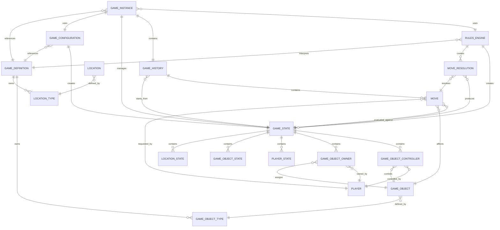

# Ludus Domain Model

## Purpose

The Ludus domain model defines the fundamental concepts required to represent, create, evaluate, and evolve games within the framework.

A GameDefinition describes the immutable structure of a supported game, including the types of locations and objects that may exist within that game. A GameConfiguration selects the options used to create a specific game instance and produces the initial GameState. A GameInstance represents a single occurrence of a game being played and coordinates the current state, history, configuration, and rules implementation.

The domain model represents the identity, structure, state, and relationships of a game. It does not define how a game is played. Game-specific behavior belongs to the RulesEngine, which evaluates moves and produces new immutable game states.

The model should support:

- multiple game definitions
- multiple configurations of the same game
- immutable game states
- human and automated players
- replay systems
- deterministic simulation
- tournament evaluation
- AI search algorithms

## Design Principles

### Immutable State

GameState represents an immutable snapshot of a game at a specific point in time. Applying a Move never modifies an existing GameState. Instead, the RulesEngine evaluates the move and produces a new GameState representing the resulting position.

This design enables:

- deterministic execution
- replay systems
- debugging
- branching timelines
- parallel analysis
- AI search algorithms such as Minimax and Monte Carlo Tree Search

A GameState represents where the game is. It does not represent how the game reached that position.

The sequence of changes that produced a state is represented separately through GameHistory, which stores the initial state and the ordered sequence of accepted moves.

## Separation of Responsibilities

Each domain concept owns only the information it represents. The domain model represents facts about a game. The RulesEngine determines behavior.

For example:

A GameDefinition owns:

- immutable game structure
- LocationType definitions
- GameObjectType definitions

A GameDefinition does not own:

- active locations
- players
- game objects
- current game state
- game history
- game behavior

A GameObject represents an individual object that exists within a game but does not know:

- its current state
- where it is located
- who owns it
- who controls it
- how it behaves

Those concepts are represented separately through:

- GameObjectState
- GameObjectOwner
- GameObjectController
- other state or relationship concepts

Similarly, a Location represents a specific place within a game but does not contain mutable information about that location. Mutable values are represented through LocationState within a GameState.

The RulesEngine is responsible for interpreting these facts and determining valid actions, move outcomes, and resulting states.

## Composition Over Inheritance

The core model avoids deep inheritance hierarchies. Games are defined through composition of immutable definitions, runtime entities, state components, relationships, and rules implementations.

A game does not require framework subclasses to represent every variation. Instead, different games provide their own:

- GameDefinition
- GameConfiguration
- RulesEngine

For example, Chess and Checkers may share the same framework concepts while providing different definitions, configurations, and rules implementations.

The framework provides the structure required to represent a game. The rules implementation provides the behavior that determines how that game evolves.

## Core Concepts


### Game Definition Concepts

#### GameDefinition

##### Description

A GameDefinition represents the immutable definition of a game supported by the framework. A GameDefinition describes the static characteristics of a game, including the GameObjectTypes and LocationTypes that define the objects and locations that may exist within the game. It provides the immutable structural information required by other framework components, such as the RulesEngine, to interpret and evolve GameStates. A GameDefinition does not represent a running game instance, a specific GameState, or the behavior used to apply game rules.

##### Owns

- LocationType
- GameObjectType

##### Does Not Own

- Location
- Player
- GameObject
- RulesEngine
- GameConfiguration
- GameState

##### Example

```text
GameDefinition

    Chess

        GameObjectTypes:
            King
            Queen
            Bishop
            Knight
            Rook
            Pawn

        LocationTypes:
            Board Square
```

#### GameConfiguration

##### Description

A GameConfiguration represents the immutable options selected when creating a new game instance. A GameConfiguration references a GameDefinition and defines how that game is initialized. It is responsible for producing the initial GameState. A GameConfiguration may define the game variant, initial setup, player configuration, and other creation-time options. The resulting GameState is managed independently by the RulesEngine. A GameConfiguration does not represent the current state of a game. Multiple GameConfigurations may reference the same GameDefinition while producing different initial GameStates (e.g., standard chess vs Fischer random).

##### References

- GameDefinition

##### Creates

- GameState

##### Does Not Own

- GameDefinition
- GameState
- Location
- Player
- GameObject

#### LocationType

##### Description

A LocationType defines the immutable characteristics shared by all Locations of the same type. A LocationType identifies what kind of location a Location represents, such as a board space, inventory, territory, hand, deck, or discard pile. A LocationType contains the static attributes required to interpret Locations of that type but does not represent a specific Location within a game and does not contain mutable state.

##### Owns

- unique type identity
- immutable attributes

##### Does Not Own

- Location
- Player
- GameObject
- GameState

#### GameObjectType

##### Description

A GameObjectType defines the immutable characteristics shared by all GameObjects of the same type. A GameObjectType identifies what kind of object a GameObject represents, such as a chess piece, playing card, territory, unit, or resource. A GameObjectType contains the static attributes and rules-related information required to interpret objects of that type. A GameObjectType does not represent an individual object within a game and does not contain mutable state.

##### Owns

- unique type identity
- immutable attributes

##### Does Not Own

- GameObject
- GameObjectState
- GameObjectOwner
- GameObjectController
- GameState

##### Example

```text
GameObjectType

    Iron Helm

    Immutable Attributes:
        Material: Iron
        Armor Rating: 5
        Equipment Slot: Head
        Maximum Durability: 100
```

### Runtime Concepts

#### GameInstance

##### Description

A GameInstance represents a single occurrence of a game being played or a completed game that has been played. A GameInstance manages the lifecycle of a specific game by coordinating the GameDefinition, GameConfiguration, RulesEngine, GameHistory, and current GameState. A GameInstance represents one unique play session and is independent from other instances created from the same GameDefinition. The GameInstance does not define game behavior; behavior is provided by the RulesEngine associated with the game.

##### Owns

- GameConfiguration
- Initial GameState
- Current GameState
- GameHistory

##### References

- GameDefinition
- RulesEngine

##### Does Not Own

- GameDefinition
- RulesEngine
- Location
- Player
- GameObject

##### Example

```text
GameInstance

    Chess Match #1024

    GameDefinition:
        Chess

    GameConfiguration:
        Standard Chess

    RulesEngine:
        ChessRulesEngine

    Current GameState:
        Move 42 Position

    GameHistory:
        Initial GameState:
            Starting Chess Position

        Moves:
            e4
            e5
            Nf3
            Nc6
            ...
```

#### GameHistory

##### Description

A GameHistory represents the sequence of accepted Moves that transformed an initial GameState into the current state of a game. A GameHistory contains the initial GameState and the ordered sequence of Moves applied after that state. Intermediate GameStates are not owned by GameHistory and are derived by applying Moves through the RulesEngine. GameHistory does not define game behavior and does not directly modify GameStates.

##### Owns

- Ordered Sequence of Moves

##### References

- Initial GameState

##### Uses

- RulesEngine

##### Does Not Own

- Derived GameStates
- MoveResolution

#### GameState

##### Description

A GameState represents an immutable snapshot of a game at a specific point in time. A GameState contains all mutable information required to completely describe the current position of a game, including the player whose turn it currently is. A GameState does not contain the history of how it was reached or the rules that determine how the game progresses. Applying a Move never modifies an existing GameState. Instead, the RulesEngine produces a new GameState representing the result of applying a Move, including any changes to the current player turn.

##### Contains

['LocationState', 'GameObjectState', 'GameObjectOwner', 'GameObjectController']

##### References

- LocationID
- PlayerId
- GameObjectId

##### Does Not Own

- GameDefinition
- GameConfiguration
- RulesEngine
- Move
- GameHistory

##### Example

```text
GameState

    Contains:

        GameObjectState:
            Helm_001
                Durability: 10

            Helm_002
                Durability: 5


        GameObjectOwner:
            Helm_001
                Owner: Player_A

            Helm_002
                Owner: Player_B
```

#### Location

##### Description

A Location represents an immutable instance of a LocationType within a game. A Location defines the identity of a specific place where GameObjects and Players may exist, such as a board position, inventory, territory, hand, deck, or discard pile. A Location references the LocationType that describes its shared immutable characteristics. Mutable information associated with a Location is represented separately by LocationState.

##### Owns

- LocationId

##### References

- LocationType

##### Does Not Own

- LocationType
- LocationState
- GameState
- GameObject
- Player

#### Player

##### Description

A Player represents an entity that participates in a game. A Player may represent a human participant or an automated participant. The Game Master is a special system entity used to represent objects, resources, and information controlled by the game itself. The Game Master is represented using a PlayerId for ownership and control relationships, but it does not necessarily represent an actual player participating in the game.

##### Owns

- PlayerId

##### Does Not Own

- GameObject
- GameObjectOwner
- GameObjectController
- GameState

##### Example

```text
Player

    Player_A
        Id: Player_A
        Name: Alice
        Type: Human


    Player_B
        Id: Player_B
        Name: Bob
        Type: Human


    Game_Master
        Id: Game_Master
        Name: Game Master
        Type: System
```

#### GameObject

##### Description

A GameObject represents an immutable instance of a GameObjectType that exists within a game. A GameObject defines the identity of a specific object and references the GameObjectType that describes its shared immutable characteristics. Mutable information about an object is represented separately through state and relationship concepts such as GameObjectState, GameObjectOwner, and GameObjectController. A GameObject does not contain the current state of the object and does not directly own ownership or control relationships.

##### Owns

- GameObjectId

##### References

- GameObjectType

##### Does Not Own

- GameObjectType
- GameObjectState
- GameObjectOwner
- GameObjectController
- GameState
- Player

##### Example

```text
GameObject

    Helm_001
        Type: Iron Helm

    Helm_002
        Type: Iron Helm
```

Helm_001 and Helm_002 are separate GameObjects with unique identities. Both reference the same GameObjectType but represent different individual objects within the game.

### Location State Concepts

#### LocationState

##### Description

LocationState represents the mutable state values associated with a specific Location within a GameState. These values may change throughout the course of a game as the result of domain actions. LocationState does not define the identity or immutable characteristics of a Location; it stores the current values required to represent that Location at a specific point in time. LocationState is part of a GameState and is replaced whenever a new GameState is produced.

##### Contains

['mutable location state values']

##### References

- LocationId

##### Does Not Own

- Location
- LocationType
- GameState

### Player State Concepts

#### PlayerState

##### Description

PlayerState represents the mutable state values associated with a specific Player within a GameState. These values may change throughout the course of a game as the result of domain actions. PlayerState does not define the identity of a Player or the immutable characteristics of a participant; it stores the current values required to represent that Player's state at a specific point in time. PlayerState is part of a GameState and is replaced when a new GameState is produced.

##### Contains

['mutable player state values']

##### References

- PlayerId

##### Does Not Own

- Player
- PlayerId
- GameState
- GameObject
- GameObjectOwner
- GameObjectController

##### Example

```text
PlayerState

    PlayerId:
        Player_A

    Attributes:

        Health:
            85 / 100

        Strength:
            14

        Dexterity:
            12

        Intelligence:
            16

        Level:
            5

        Experience:
            2400

        Gold:
            150
```

### Game Object State Concepts

#### GameObjectState

##### Description

GameObjectState represents the mutable state values associated with a specific GameObject. These values may change throughout the course of a game as the result of domain actions. GameObjectState does not define what properties a GameObject has; it stores the current values of those properties for an individual GameObject. GameObjectState is part of a GameState and is replaced when a new GameState is produced.

##### Contains

['stat values']

##### References

- GameObjectId

##### Does Not Own

- GameObject
- GameObjectType
- GameState
- GameObjectOwner
- GameObjectController

##### Example

```text
GameObjectState

    Helm_001
        Durability: 10

    Helm_002
        Durability: 5
```

Both GameObjects share the same GameObjectType but maintain separate mutable stats.

### Game Object Relationship Concepts

#### GameObjectOwner

##### Description

GameObjectOwner represents the ownership relationship between a GameObject and a Player. Every GameObject has exactly one owner. The owner may be a human player, an automated participant, or a system-controlled participant such as the Game Master. Ownership may change throughout the course of a game as the result of domain actions. Ownership is independent from control and does not grant control automatically.

##### References

- PlayerId
- GameObjectId

##### Does Not Own

- GameObject
- Player
- GameObjectController

##### Example

```text
GameObjectOwner

    Helm_001
        Owner: Player_A

    Helm_002
        Owner: Player_B
```

Ownership is independent for each GameObject instance, even when the GameObjects share the same GameObjectType.

#### GameObjectController

##### Description

GameObjectController represents the control relationship between a GameObject and one or more Players. Controllers identify the Players that are currently able to act on behalf of a GameObject through domain actions. Control is independent from ownership and may change throughout the course of a game as the result of domain actions. A GameObject may have multiple controllers, and a controller does not imply ownership of the GameObject.

##### References

- PlayerId
- GameObjectId

##### Does Not Own

- GameObject
- Player
- GameObjectOwner

##### Example

```text
GameObjectController

    Helm_001
        Controllers:
            Player_A

    Tent_001:
        Player_A, Player_B
```

### Action Concepts

#### Move

##### Description

A Move represents an immutable request to perform a domain action that may transform one GameState into another. A Move describes an intended change and contains the information required by the RulesEngine to evaluate that change. A Move does not directly modify a GameState and does not indicate whether the requested action is valid or has occurred. The RulesEngine evaluates the Move and produces a MoveResolution describing the result.

##### Owns

- MoveType
- Move parameters

##### References

- PlayerId
- GameObjectId

##### Uses

- GameState

##### Does Not Own

- Player
- GameObject
- GameState
- GameDefinition
- MoveResolution
- GameHistory

#### MoveResolution

##### Description

A MoveResolution represents the result of evaluating a Move against a GameState. A MoveResolution always contains a GameState representing the current state after resolution. If a Move is accepted, the GameState is a new immutable snapshot produced by the RulesEngine. If a Move is rejected, the GameState is the original unchanged snapshot and the MoveResolution contains the reasons the Move was not accepted. A MoveResolution does not modify a Move or a GameState.

##### Owns

- ResolutionStatus
- ValidationErrors

##### References

- Move
- GameState

##### Does Not Own

- Move
- GameState
- RulesEngine

### Identity Concepts

#### LocationId

##### Description

A LocationId uniquely identifies a Location within a domain. A LocationId is immutable and remains associated with the same Location for the lifetime of the Location. A LocationId does not represent a Location and does not contain information about the location's properties, contents, or current state.

##### Owns

- unique identifier value

##### Does Not Own

- Location
- LocationState

#### PlayerId

##### Description

A PlayerId uniquely identifies a Player within a domain. A PlayerId is immutable and remains associated with the same Player for the lifetime of the Player. A PlayerId does not represent a Player and does not contain any information about the Player's attributes, state, ownership, or relationships.

##### Owns

- unique identifier value

##### Does Not Own

- Player
- GameObject
- GameObjectOwner
- GameObjectController

##### Example

```text
PlayerId

    Player_A
    Player_B
```

Each Player has a unique PlayerId.

PlayerId is used by domain relationships to identify Players without requiring a direct reference to the Player entity.

#### GameObjectId

##### Description

A GameObjectId uniquely identifies a GameObject within a domain. A GameObjectId is immutable and remains associated with the same GameObject for the lifetime of the object. A GameObjectId does not represent a GameObject and does not contain information about the object's type, state, ownership, control, or relationships.

##### Owns

- unique identifier value

##### Does Not Own

- GameObject
- GameObjectType
- GameObjectState
- GameObjectOwner
- GameObjectController

##### Example

```text
GameObjectId

    Helm_001
    Helm_002
```

Each GameObject has a unique GameObjectId.

GameObjectId is used by domain relationships and state components to identify specific GameObjects without requiring direct references to the GameObject entity.

### Domain Service Concepts

#### RulesEngine

##### Description

A RulesEngine defines the game-specific behavior required to interpret GameStates, evaluate Moves, and produce resulting GameStates. It is stateless and does not own game state or game progression. Given a GameState, a RulesEngine can determine the set of legal Moves available from that state. This capability allows game states to be explored by simulation systems and AI search algorithms such as Minimax and Monte Carlo Tree Search. Given a GameState and Move, the RulesEngine evaluates the requested action and produces a MoveResolution describing the result of the evaluation. The RulesEngine never modifies existing GameStates, stores current state, or maintains game history.

##### References

- GameDefinition

##### Uses

- GameState
- Move

##### Creates

- MoveResolution
- GameState
- Move

##### Does Not Own

- GameDefinition
- GameConfiguration
- GameState
- Move
- MoveResolution
- GameHistory

## Scope

The domain model intentionally excludes:

- turn execution
- game loops
- rendering
- user interfaces
- networking
- artificial intelligence
- event publishing
- player decision systems

## Domain Structure Diagram

The following structural diagram illustrates the relationships between the core domain concepts.



