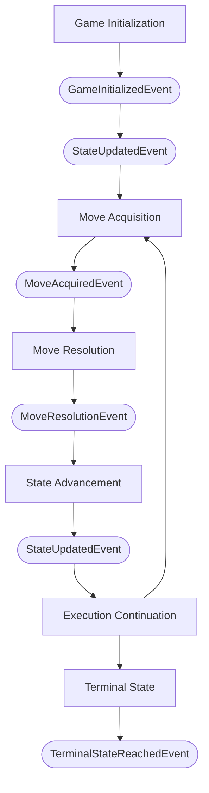
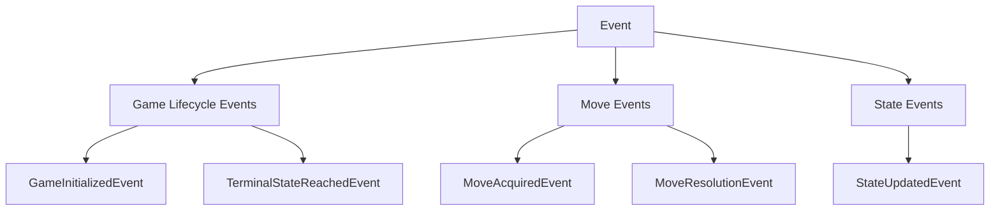

# Ludus Event Model

## Purpose

The Ludus event system provides a mechanism for framework components to communicate observations about game execution without creating direct dependencies between systems. Events allow independent systems such as   rendering,   networking, replay, and debugging to observe game execution while preserving the separation between game logic and external concerns.

Events are descriptive records of things that have occurred within the framework. They do not perform actions, determine game behavior, or modify game state. The event model exists to support the following framework capabilities:

-rendering updates
-network synchronization
- replay recording
- analytics collection
- debugging tools
- tournament infrastructure
- execution monitoring
- future framework integrations

The event model follows the same architectural principles as the rest of the Ludus framework:

- immutable data
- deterministic execution
- separation of concerns
- engine-controlled state transitions
- gamebehavior contained within rules implementations
- external systems interacting through framework contracts

# Ludus Event Model

## Purpose

The Ludus event system provides a mechanism for observing game execution without creating direct dependencies between the components that participate in or observe that execution. An event is an immutable notification that something meaningful has occurred during game execution. Events describe completed occurrences within the framework. They do not perform actions, determine game behavior, modify game state, or control execution.

The event model is independent of the systems that consume events. A consumer may use events for rendering, networking, replay, analytics, debugging, tournament infrastructure, or other purposes, but the event model itself has no knowledge of those systems.

The event model follows the same architectural principles as the rest of the Ludus framework:

* immutable data
* deterministic execution
* separation of concerns
* engine-controlled state transitions
* game behavior contained within rules implementations
* external systems interacting through framework contracts

## Game Execution Lifecycle

Events correspond to meaningful points in the lifecycle of game execution.

The execution lifecycle is:



The initial GameState is represented by the first StateUpdatedEvent following GameInitializedEvent. Each subsequent successful state transition produces another StateUpdatedEvent. A rejected Move produces a MoveResolutionEvent but does not produce a StateUpdatedEvent, because the current GameState has not changed. When execution reaches a terminal state, TerminalStateReachedEvent is produced.

## Event Hierarchy

Events are organized into categories according to the aspect of game execution they describe. The event categories and their events are:



The categories are organizational concepts and do not represent events themselves. The concrete events are the notifications produced during game execution.

### GameLifecycleEvent

`GameLifecycleEvent` represents an event associated with the lifecycle of a game.

It contains events that describe significant lifecycle transitions of a game instance.

Current lifecycle events include:

* `GameInitializedEvent`
* `TerminalStateReachedEvent`

### MoveEvent

`MoveEvent` represents an event associated with the acquisition and resolution of a `Move`.

It contains events that describe meaningful points in the processing of a move.

Current move events include:

* `MoveAcquiredEvent`
* `MoveResolutionEvent`

### StateEvent

`StateEvent` represents an event associated with changes to the current `GameState`.

It currently contains:

* `StateUpdatedEvent`

`StateUpdatedEvent` represents the point at which the current `GameState` has been replaced by a new immutable `GameState`.

## Event Sequence

For a game that progresses through multiple moves, the event sequence is:

```text
GameInitializedEvent
StateUpdatedEvent

MoveAcquiredEvent
MoveResolutionEvent
StateUpdatedEvent

MoveAcquiredEvent
MoveResolutionEvent
StateUpdatedEvent

...

TerminalStateReachedEvent
```

If a `Move` is rejected, the sequence is:

```text
MoveAcquiredEvent
MoveResolutionEvent
```

with no `StateUpdatedEvent`, because the `GameState` remains unchanged.

The event sequence therefore describes what actually occurred during execution rather than exposing internal implementation steps.

## Event Model Concepts

### Event Concepts

#### Event

##### Description

An Event represents an immutable observation of something that occurred during framework execution. Events describe completed facts about execution after they happen. An Event does not request actions, determine game behavior, modify GameState, or replace the authoritative game state model. Events provide a communication mechanism between framework execution services and external systems such as rendering, networking, replay, analytics, debugging, and tournament infrastructure while preserving separation of concerns and deterministic execution.

##### Owns

- event type
- execution context
- event metadata

##### References

- GameInstance
- GameState
- Move

##### Does Not Own

- GameInstance
- GameState
- RulesEngine
- Move
- GameHistory

##### Example

```text
Event

    Type:
        StateTransitionEvent

    Context:
        GameInstance: Chess Match #1024

    Data:
        Previous GameState:
            Position 41

        New GameState:
            Position 42

        Move:
            e4
```

### Event Context Concepts

#### GameEvent

##### Description

A GameEvent represents an Event associated with a specific game execution. A GameEvent provides context identifying the GameInstance and execution point where the Event occurred. GameEvents allow external systems to observe game execution without creating direct dependencies on the internal execution process.

##### References

- GameInstance
- GameState
- Move

##### Does Not Own

- GameInstance
- GameState
- RulesEngine
- GameHistory

#### ExecutionEvent

##### Description

An ExecutionEvent represents an Event generated during the lifecycle of game execution. ExecutionEvents describe activity performed by framework execution services such as the GameEngine, including execution lifecycle changes, move requests, move submissions, move evaluation, and execution completion. An ExecutionEvent describes framework activity that has occurred and does not determine game behavior, modify GameState, or control execution.

##### Responsibilities

- represent framework execution activity
- provide execution lifecycle information to event consumers
- identify relevant execution context

##### References

- GameInstance
- GameState
- Move
- MoveResolution
- GameEngine

##### Does Not Own

- GameInstance
- GameState
- Move
- MoveResolution
- RulesEngine
- GameHistory

##### Example

```text
ExecutionEvent

    Type:
        MoveSubmittedEvent

    Context:
        GameInstance:
            Chess Match #1024

    Move:
        e4

    State:
        Position 41
```

### Event Category Concepts

#### LifecycleEvent

##### Description

A LifecycleEvent represents an Event associated with a change in the lifecycle of a GameInstance. LifecycleEvents allow framework components and external systems to observe significant points in the lifetime of a game session, such as when a game is initialized, started, completed, or terminated. A LifecycleEvent describes a lifecycle change that has occurred and does not control execution, modify GameState, or determine game behavior.

##### Responsibilities

- represent GameInstance lifecycle activity
- provide lifecycle information to event consumers
- identify the GameInstance associated with the lifecycle event

##### References

- GameInstance
- GameState

##### Does Not Own

- GameInstance
- GameConfiguration
- GameState
- GameHistory
- RulesEngine

#### MoveEvent

##### Description

A MoveEvent represents an Event related to a Move during game execution. A MoveEvent allows framework components and external systems to observe the lifecycle of a Move, including when a Move is requested, submitted, accepted, or rejected. A MoveEvent does not determine whether a Move is valid, apply game rules, modify GameState, or control game execution. Move validation remains the responsibility of the RulesEngine.

##### Responsibilities

- represent activity related to a Move
- provide Move lifecycle information to event consumers
- identify the Move and execution context associated with the event

##### References

- Move
- PlayerId
- GameState

##### Does Not Own

- Move
- Player
- GameState
- RulesEngine
- MoveResolution
- GameHistory

#### StateTransitionEvent

##### Description

A StateTransitionEvent represents the creation of a new immutable GameState resulting from a successful state transition. A StateTransitionEvent is published after the RulesEngine evaluates a Move and produces a new GameState. The event records the completed transition but does not perform the transition or replace the authoritative GameState.

##### References

- GameState
- Move
- MoveResolution
- RulesEngine

##### Does Not Own

- GameState
- Move
- MoveResolution
- RulesEngine

##### Relationship

```text
StateTransitionEvent

    observes:
        RulesEngine

    records:
        Previous GameState
        New GameState
        Move

    consumed by:
        Rendering Systems
        Replay Systems
        Network Systems
```

# Event Lifecycle

Events follow the lifecycle of framework execution.

A typical execution sequence is:

```text
GameEngine

    |
    | creates GameInstance
    v

GameStartedEvent

    |
    | requests Move
    v

MoveRequestedEvent

    |
    | receives Move
    v

MoveSubmittedEvent

    |
    | evaluates Move
    v

RulesEngine

    |
    | produces MoveResolution
    v

MoveAcceptedEvent

    |
    | creates new GameState
    v

StateTransitionEvent

    |
    | updates GameHistory
    v

Execution continues
```

Events are produced only after the associated operation has reached a meaningful execution point.

Events do not represent possible future actions.

---

# Event Publishing Responsibilities

## GameEngine

### Responsibility

The `GameEngine` is the primary event publisher within the framework.

The `GameEngine` publishes events related to execution coordination, including:

- game lifecycle events
- move lifecycle events
- state transition events
- execution status events

The `GameEngine` is responsible for publishing events because it coordinates:

- `GameInstance`
- `RulesEngine`
- `MoveProvider`
- `GameHistory`

The `GameEngine` does not create game-specific events describing rule behavior unless that behavior is part of the framework execution lifecycle.

---

## RulesEngine

### Responsibility

The `RulesEngine` does not publish execution events directly.

The `RulesEngine` evaluates moves and produces `MoveResolution` objects. The `GameEngine` interprets those results and publishes appropriate events.

This preserves the stateless design of the `RulesEngine`.

The relationship is:

```text
RulesEngine

    receives:
        GameState
        Move

    produces:
        MoveResolution


GameEngine

    receives:
        MoveResolution

    publishes:
        Events
```

---

## MoveProvider

### Responsibility

A `MoveProvider` does not publish framework execution events.

A `MoveProvider` provides decisions to the `GameEngine`.

The source of a move may be:

- human input
- artificial intelligence
- network client
- replay system
- automated process

The framework observes the resulting execution through events rather than requiring each provider type to implement event behavior.

---

## External Systems

External systems consume events but do not publish framework execution events.

Examples:

- rendering systems
- network synchronization systems
- replay recorders
- analytics services
- tournament infrastructure

External systems may transform events into their own internal representations, but they do not influence framework execution through the event system.

---

# Relationship Between Events and Immutable State

Events and `GameState` serve different purposes.

`GameState` represents the authoritative current condition of a game.

Events represent observations about execution.

The relationship is:

```text
GameState

    represents:
        current truth


Event

    represents:
        something that happened
```

A state transition produces both:

```text
Move
 |
 v
RulesEngine
 |
 v
New GameState
 |
 +----------------+
 |                |
 v                v

GameHistory     Event
```

The `GameState` remains the source of truth.

Events provide a chronological view of execution activity.

Events must never be used as the authoritative representation of game state.

---

# Event Consumers

## Rendering Systems

Rendering systems consume events to update visual representations of the game.

Examples:

- object movement
- piece placement changes
- player status updates
- animations

Rendering systems should obtain current information from `GameState` and use events to determine what changed.

---

## Network Systems

Network systems consume events to synchronize game execution between connected systems.

Examples:

- broadcasting accepted moves
- notifying clients of state transitions
- updating spectators

Network systems should not apply game logic based only on events.

They should synchronize framework state.

---

## Replay Systems

Replay systems consume events to record execution history.

Events may provide:

- move sequence
- state transition sequence
- timing information
- execution metadata

Replay systems may reconstruct games by applying recorded moves through the appropriate `RulesEngine`.

---

## Analytics Systems

Analytics systems consume events to gather information about game execution.

Examples:

- move frequency
- game duration
- player decisions
- performance statistics

Analytics systems should not affect gameplay behavior.

---

## Debugging Systems

Debugging systems consume events to inspect framework execution.

Examples:

- execution tracing
- move validation analysis
- state transition inspection
- error reporting

---

## AI Systems

AI systems may consume events to observe completed executions.

Examples:

- training data collection
- evaluation metrics
- simulation analysis

AI decision-making systems receive game context through framework APIs such as `GameState`, not through events.

---

# Integration Boundaries

The event system creates a controlled communication boundary between the framework and external systems.

The dependency direction is:

```text
                Events

                  ^
                  |

Rendering
Networking
Replay
Analytics
Debugging
Tournament Systems


                  ^
                  |

              GameEngine


                  ^
                  |

          RulesEngine
          GameInstance
          GameState
```

External systems depend on framework events.

The framework does not depend on external systems.

---

# Design Constraints

The event system follows these constraints:

## Events Are Immutable

Events represent completed observations and cannot be modified after creation.

---

## Events Do Not Change State

Events cannot directly modify:

- `GameState`
- `GameInstance`
- `GameHistory`
- domain entities

All state changes occur through the `RulesEngine`.

---

## Events Are Not Commands

Events describe what happened.

They do not request what should happen.

Examples:

Valid:

```text
MoveAcceptedEvent

    Move:
        e4
```

Invalid:

```text
MoveEvent

    Execute:
        e4
```

---

## Events Do Not Replace History

`GameHistory` represents the ordered sequence of accepted moves.

Events represent broader execution observations.

A replay system may use events, but the authoritative game progression remains based on:

- initial `GameState`
- accepted `Moves`
- `RulesEngine`

---

## Events Must Preserve Determinism

Given identical inputs and execution conditions, the framework should produce the same state transitions and corresponding events.

Events should contain deterministic information wherever possible.

---

# Example Event Flow

A complete move execution flow:

```text
1. GameEngine requests a move

    Event:
        MoveRequestedEvent


2. MoveProvider returns a move

    Event:
        MoveSubmittedEvent


3. GameEngine submits move to RulesEngine


4. RulesEngine evaluates move


5. RulesEngine produces MoveResolution


6. GameEngine receives accepted resolution

    Event:
        MoveAcceptedEvent


7. GameEngine replaces current GameState


8. GameEngine updates GameHistory


9. GameEngine publishes:

    StateTransitionEvent


10. External systems consume events

    Rendering:
        update display

    Replay:
        record transition

    Network:
        synchronize clients

    Analytics:
        record statistics
```

The event model provides observation and integration without weakening the framework's core guarantees of immutable state, deterministic execution, and controlled state transitions.

