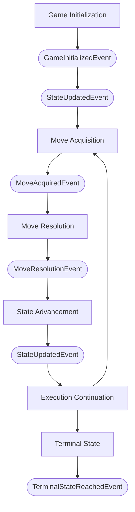
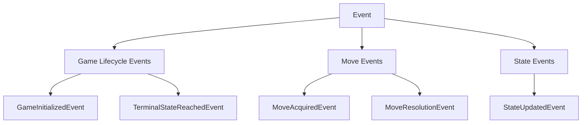

# Ludus Event Model

## Purpose

The Ludus event system provides a mechanism for observing game execution without creating direct dependencies between the components that participate in or observe that execution. An event is an immutable notification that something meaningful has occurred during game execution. Events describe completed occurrences within the framework. They do not perform actions, determine game behavior, modify game state, or control execution.

The event model is independent of the systems that consume events. A consumer may use events for rendering, networking, replay, analytics, debugging, tournament infrastructure, or other purposes, but the event model itself has no knowledge of those systems.

The event model follows the same architectural principles as the rest of the Ludus framework:

* immutable data
* deterministic execution
* separation of concerns
* engine-controlled state transitions
* game behavior contained within rules implementations
* external systems interacting through framework contracts

## Game Execution Lifecycle

Events correspond to meaningful points in the lifecycle of game execution. The execution lifecycle is:

The initial GameState is represented by the first StateUpdatedEvent following GameInitializedEvent. Each subsequent successful state transition produces another StateUpdatedEvent. A rejected Move produces a MoveResolutionEvent but does not produce a StateUpdatedEvent, because the current GameState has not changed. When execution reaches a terminal state, TerminalStateReachedEvent is produced.

## Event Hierarchy

Events are organized into categories according to the aspect of game execution they describe. The event categories and their events are:

The categories are organizational concepts and do not represent events themselves. The concrete events are the notifications produced during game execution.

## Event Services

### Game Lifecycle Event Concepts

#### GameInitializedEvent

##### Description

A GameInitializedEvent represents an immutable notification that a GameInstance has been initialized and is ready for game execution. A GameInitializedEvent indicates that game initialization has completed but does not itself create, modify, or control the GameInstance or its GameState.

##### Owns

- event information

##### Does Not Own

- GameInstance
- GameDefinition
- GameConfiguration
- GameState
- GameEngine
- RulesEngine

#### TerminalStateReachedEvent

##### Description

A TerminalStateReachedEvent represents an immutable notification that a GameInstance has reached a terminal GameState. It indicates that game execution has reached a state in which no further moves are expected to be executed. A TerminalStateReachedEvent does not determine whether a GameState is terminal, modify the GameState, or control game execution.

##### Owns

- event information

##### Does Not Own

- GameInstance
- GameState
- Move
- GameEngine
- RulesEngine

### Move Event Concepts

#### MoveAcquiredEvent

##### Description

A MoveAcquiredEvent represents an immutable notification that a Move has been acquired for evaluation during game execution. It indicates that the GameEngine has received a Move from a MoveProvider and that the Move is ready to be evaluated by the RulesEngine. A MoveAcquiredEvent does not determine whether the Move is valid, modify the GameState, or apply game rules.

##### Owns

- event information

##### Does Not Own

- Move
- GameState
- MoveProvider
- GameEngine
- RulesEngine

#### MoveResolutionEvent

##### Description

A MoveResolutionEvent represents an immutable notification that a Move has been evaluated by the RulesEngine and that a MoveResolution has been produced. It indicates the result of evaluating the Move, including whether the Move was accepted or rejected. A MoveResolutionEvent does not modify the GameState or apply the Move itself.

##### Owns

- event information

##### References

- Move
- MoveResolution

##### Does Not Own

- Move
- MoveResolution
- GameState
- RulesEngine
- GameEngine

### State Event Concepts

#### StateUpdatedEvent

##### Description

A StateUpdatedEvent represents an immutable notification that the current GameState of a GameInstance has been replaced by a new immutable GameState. It indicates that the new GameState was established either during game initialization or as the result of an accepted Move. A StateUpdatedEvent does not modify the GameState or determine whether a state transition should occur.

##### Owns

- event information

##### References

- GameState

##### Does Not Own

- GameInstance
- GameState
- Move
- MoveResolution
- RulesEngine
- GameEngine

## Event Publishing

The GameEngine is the authoritative publisher of framework execution events and publishes all framework execution events; other framework components do not publish execution events directly.

The RulesEngine evaluates Moves and produces MoveResolutions. The MoveProvider provides Moves to the GameEngine. The GameEngine coordinates these operations and publishes events describing the resulting execution. This establishes a clear separation between performing an operation and reporting that the operation occurred.

## Scope

The event model defines how Ludus represents and publishes observations of game execution. It establishes the relationship between events and the execution lifecycle, the conceptual organization of events, and the responsibility of the GameEngine as the authoritative event publisher.

The event model intentionally does not define how events are consumed or how consuming systems implement their own behavior. Systems such as rendering, networking, replay, analytics, debugging, and tournament infrastructure may consume events through framework-defined APIs, but those systems are outside the scope of the event model.

The event model also does not define game rules or state transitions. Those responsibilities remain part of the execution and domain models.

## Summary

The Ludus event model provides an immutable mechanism for observing meaningful occurrences during game execution. Events describe what has occurred without controlling execution, modifying state, or determining game behavior. The GameEngine publishes framework execution events as it coordinates the game lifecycle, while other framework components remain responsible for their defined operations.

This allows external systems to observe game execution without creating dependencies between those systems and the framework's core execution logic.

