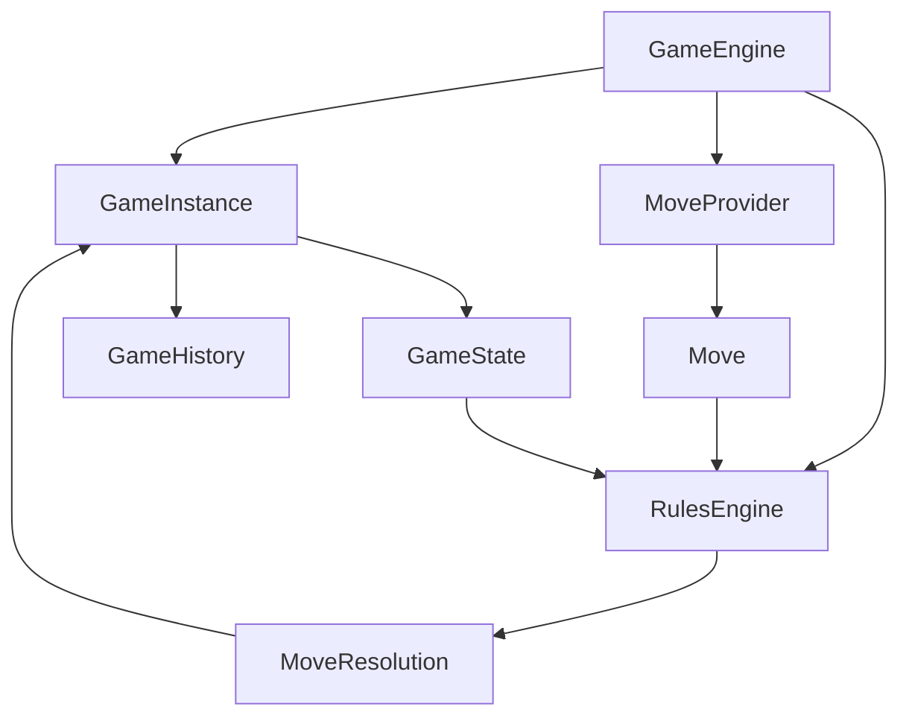
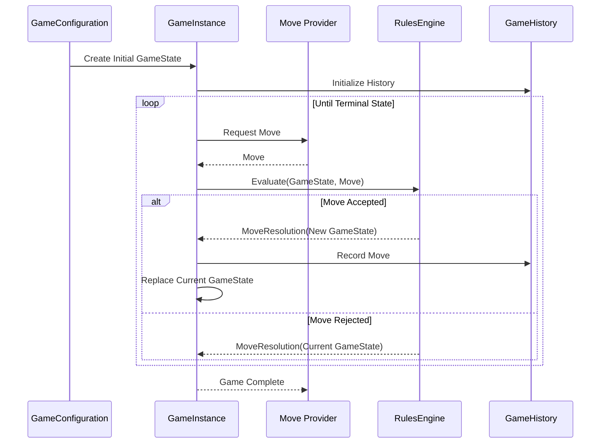
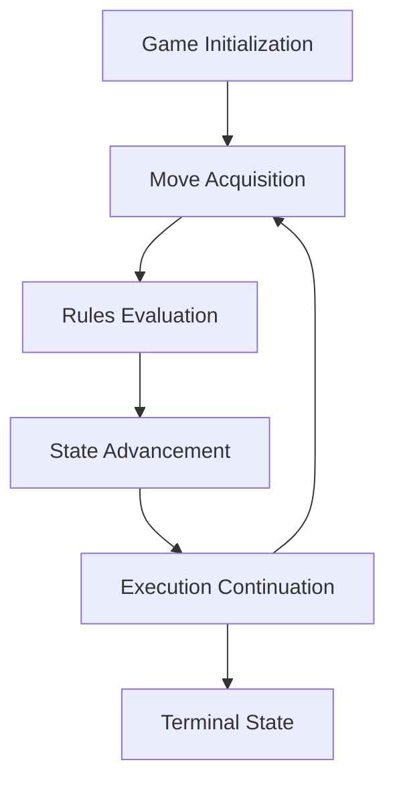

# Ludus Execution Model

## Purpose

The Ludus execution model defines how a game progresses from initialization to completion. It describes the responsibilities of the framework during game execution and the interactions between the core domain concepts defined in the Domain Model. Unlike the Domain Model, which describes _what_ the framework represents, the execution model describes _how_ those concepts collaborate over time.

The execution model is intentionally independent of:

-   rendering
-   networking
-   user interfaces
-   artificial intelligence    
-   replay viewers
-   event systems

These systems interact with the execution model through the framework's public APIs but do not participate in game state evaluation.

## Goals

The execution model is designed to satisfy several fundamental goals.

-   extensibility across many game types
-   deterministic execution
-   immutable game state
-   reproducible simulations
-   replayable games
-   support for human and automated players
-   efficient AI search

Every execution path through the framework should satisfy these goals.

## Core Principles

### State is Immutable

The execution model never modifies an existing GameState. Every accepted Move produces a new immutable GameState. Rejected moves leave the current GameState unchanged.

This enables:

-   deterministic replay
-   branching simulations    
-   debugging
-   parallel analysis
-   AI search algorithms

### Behavior Lives in the Rules Engine

The framework coordinates execution. The RulesEngine determines game behavior. Given a GameState and a Move, the RulesEngine evaluates the move and produces a MoveResolution containing the resulting GameState. The execution engine never interprets game-specific rules.

### The Framework Coordinates

The framework owns execution. Games provide behavior. The framework is responsible for:

-   creating game instances
-   requesting moves
-   invoking the RulesEngine
-   updating history
-   advancing execution
-   determining when execution terminates

The framework is not responsible for deciding how a particular game is played.

## Execution Services

The execution model is implemented through a set of framework services that coordinate the progression of a game while maintaining separation between execution, game state, and game-specific behavior. Execution services are responsible for coordinating gameplay; they do not define the rules of a game, own immutable domain definitions, or directly modify game state.

The primary execution services are:

-   GameEngine
-   GameInstance
-   RulesEngine
-   MoveProvider
-   GameHistory

Together, these services transform a sequence of player decisions into a deterministic sequence of immutable GameStates.



### Execution Service Concepts

#### GameEngine

##### Description

A GameEngine is a framework service responsible for coordinating the execution of a game session. A GameEngine manages the execution lifecycle by requesting Moves, submitting Moves to the RulesEngine for evaluation, processing MoveResolutions, replacing the current GameState with resulting immutable GameStates, and updating GameHistory. A GameEngine does not contain game-specific rules, interpret the meaning of Moves, or directly modify existing GameStates. Instead, it coordinates the interaction between execution services and domain concepts while preserving the framework guarantees of immutable state transitions and deterministic execution.

##### Responsibilities

- coordinate game execution
- provide execution context for a running GameInstance
- request Moves from MoveProviders
- submit Moves to the RulesEngine
- process MoveResolutions
- replace the current GameState with resulting immutable GameStates
- update GameHistory
- detect when execution reaches a terminal state

##### References

- GameInstance
- RulesEngine
- MoveProvider
- GameHistory
- GameState
- Move
- MoveResolution

##### Does Not Own

- GameDefinition
- GameConfiguration
- RulesEngine
- GameState
- Move
- MoveResolution
- MoveProvider
- GameHistory
- GameObject
- Player

##### Relationship

```text
GameEngine

    coordinates:
        GameInstance

    using:
        RulesEngine
        MoveProvider
```

#### MoveProvider

##### Description

A MoveProvider is a framework service responsible for providing Moves to a GameEngine during game execution. A MoveProvider represents the source of a decision within a game session and may provide Moves generated by a human player, artificial intelligence agent, network client, replay system, or automated process. A MoveProvider does not evaluate whether a Move is valid, apply game rules, modify GameStates, or control game execution. Instead, it produces Move requests that are evaluated by the RulesEngine through the GameEngine.

##### Responsibilities

- provide Moves during game execution
- receive the current GameState as decision context
- produce a Move representing an intended action
- support different sources of decision making

##### References

- GameEngine
- GameState
- Move
- Player

##### Does Not Own

- GameDefinition
- GameConfiguration
- GameInstance
- GameState
- RulesEngine
- Move
- MoveResolution
- GameHistory
- GameObject
- Location

##### Relationship

```text
MoveProvider

    provides:
        Move

    to:
        GameEngine

    using context from:
        GameState
```

### Execution Service Collaboration

During execution, these services collaborate as follows:



The execution services work together to maintain the core Ludus guarantees:

-   deterministic execution
-   immutable state transitions
-   separation of rules and infrastructure
-   support for multiple move sources
-   replayable game progression

## Execution Lifecycle

Every Ludus game progresses through the same high-level lifecycle regardless of the specific game being played. The execution lifecycle defines the major stages a game passes through from creation to completion.

The lifecycle separates:

- game creation
- state initialization
- move acquisition
- move evaluation
- state transition
- game completion

The framework controls progression through these stages while game-specific behavior is provided by the RulesEngine.



### Game Initialization

Execution begins when a GameDefinition and GameConfiguration are provided to create a new game session. The GameDefinition describes the immutable structure of the game, including the types of objects and locations that may exist. The GameConfiguration defines the options used to create a specific game instance, such as:

- player count
-  game variant
- initial setup
- optional rules
- configuration parameters

Using the GameConfiguration, the framework creates the initial GameState. The initial GameState represents the starting position of the game and becomes the foundation for future state transitions. The framework then creates a GameInstance containing the initialized execution context:

* GameConfiguration
* initial GameState
* current GameState
* GameHistory

The GameHistory is initialized using the starting GameState and contains no accepted Moves until execution begins.

The GameDefinition and RulesEngine are referenced by the GameInstance but are not owned by it.

### Move Acquisition

After initialization, execution begins requesting Moves. A Move represents an intended action within the current GameState. The execution model does not define where a Move originates or how a decision is made. Moves may be provided by:

- human players
- local artificial intelligence
- network clients
- replay systems
- automated testing systems

The component responsible for providing Moves is the MoveProvider. The MoveProvider receives the current GameState as context and produces a Move representing an intended action. The MoveProvider does not:

- validate Moves
- apply game rules
- modify GameStates
- control execution flow

The execution framework only requires that a Move is provided. The source of the decision remains outside the execution model.

### Rules Evaluation

After receiving a Move, the GameEngine submits the Move and current GameState to the RulesEngine for evaluation. The RulesEngine determines whether the requested action is valid according to the rules of the specific game and returns a MoveResolution. The RulesEngine never modifies an existing GameState. All game-specific behavior is contained within the RulesEngine.

### State Advancement

State advancement occurs after the RulesEngine returns a MoveResolution.

If the Move is accepted:

1. the resulting GameState becomes the current GameState of the GameInstance
2. the accepted Move is appended to the GameHistory
3. execution continues from the new GameState

If the Move is rejected:

1. the current GameState remains unchanged
2. the Move is not recorded in the GameHistory
3. execution continues from the existing GameState

In both cases, existing GameStates are never modified. Accepted Moves produce new immutable GameStates, while rejected Moves preserve the current GameState.

Because GameStates are immutable, previous states remain available for:

- replay
- debugging
- simulation
- branching analysis
- AI search

### Execution Continuation

After state advancement, the framework determines whether execution should continue by examining the current GameState. If the current GameState represents a terminal state, execution ends and the game transitions to the Terminal State phase. If the current GameState is not terminal, execution continues by requesting another Move from the appropriate MoveProvider.

The execution model does not define the conditions that cause a game to end. Those conditions are determined by the RulesEngine and are represented by the resulting GameState. By basing continuation solely on the current GameState, the framework remains independent of game-specific rules while supporting deterministic execution for all game types.

### Terminal State

Execution ends when the current GameState represents a completed game. A terminal GameState is produced by the RulesEngine as the result of applying a Move, with the RulesEngine determining when the rules of the game have reached a completion condition and representing that result within the resulting GameState. The execution model does not define the conditions that cause a game to end; those conditions are game-specific and belong to the RulesEngine. Examples of terminal conditions include:

- victory
- defeat
- draw
- concession
- stalemate
- scenario completion

When a terminal GameState is reached:

1. no additional Moves are requested
2. the GameInstance remains in its final state
3. the final GameState represents the completed game
4. the GameHistory contains the sequence of accepted Moves that produced the final state

Because the terminal condition is represented within the GameState, completed games can be replayed, analyzed, and reconstructed using the same deterministic execution process as active games.

## Advanced Execution Scenarios

### Automated Execution

The execution model supports automated execution using the same lifecycle as human-played games. A MoveProvider may generate Moves without human input, allowing games to be executed for purposes such as:

- unit testing
- deterministic simulations
- automated validation
- tournament evaluation
- performance analysis

Automated execution uses the same GameEngine, RulesEngine, GameInstance, and GameHistory components as interactive games. The source of the Move does not affect how the framework evaluates Moves or advances GameState.

Because execution is deterministic, the same initial GameState and sequence of Moves will always produce the same sequence of resulting GameStates.

### Replay

Replay follows the same execution lifecycle as an active game. It is performed by supplying a previously recorded sequence of accepted Moves through a specialized MoveProvider. This replay MoveProvider retrieves Moves from the stored GameHistory in the exact order they were originally applied. Each Move is then evaluated by the RulesEngine against the current GameState, producing the next GameState through the same deterministic state transition process used during normal execution.

Replay does not require storing every intermediate GameState. Given the initial GameState, the RulesEngine, and the sequence of accepted Moves, the framework can reconstruct the complete sequence of states that led to the final game state. By using the same execution path as active games, replay provides deterministic reconstruction for debugging, analysis, verification, and playback systems.

## Scope

The execution model defines the lifecycle of game execution but intentionally excludes the implementation details of systems that interact with execution. External systems may participate in game execution through framework-defined extension points, but they do not control state transitions, evaluate game rules, or directly modify GameStates.

The execution model intentionally excludes:

- rendering
- user interfaces
- networking
- artificial intelligence
- event publishing
- player decision systems
- persistence
- replay presentation

These systems interact with the execution model through public framework APIs.

Examples include:

- A user interface provides player decisions by producing Moves.
- An artificial intelligence system provides decisions through MoveProviders or uses the RulesEngine for simulation and analysis.
- A networking system transports Moves and execution information between participants.
- A rendering system observes GameStates and presents game information.
- An event system observes execution progress and publishes notifications.

Regardless of the source of a Move, all game progression follows the same execution process:

1. A Move is provided to the execution system.
2. The RulesEngine evaluates the Move against the current GameState.
3. A MoveResolution is produced.
4. Accepted Moves produce a new immutable GameState.
5. GameHistory records the accepted transition.

External systems may influence which Moves are provided, but all state transitions remain controlled by the execution framework and RulesEngine.

## Summary

The Ludus execution model treats every supported game as a deterministic sequence of immutable state transitions. The framework coordinates execution while remaining agnostic to game-specific behavior. Games define their behavior through RulesEngine implementations, allowing the same execution model to support simple games such as Tic-Tac-Toe and Chess as well as significantly more complex games such as Risk or Magic: The Gathering.

By separating execution from rules, state from identity, and coordination from presentation, the execution model provides a consistent foundation for replay systems, automated execution, deterministic simulation, networked play, AI development, and future framework extensions.

